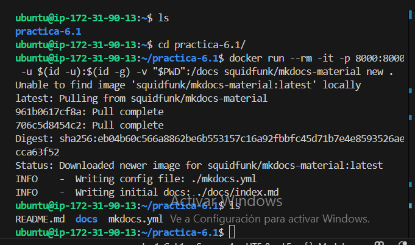
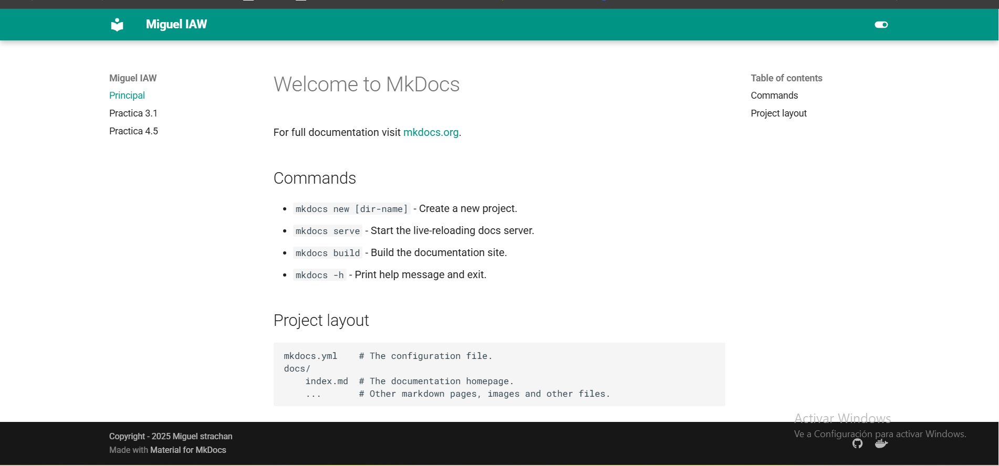
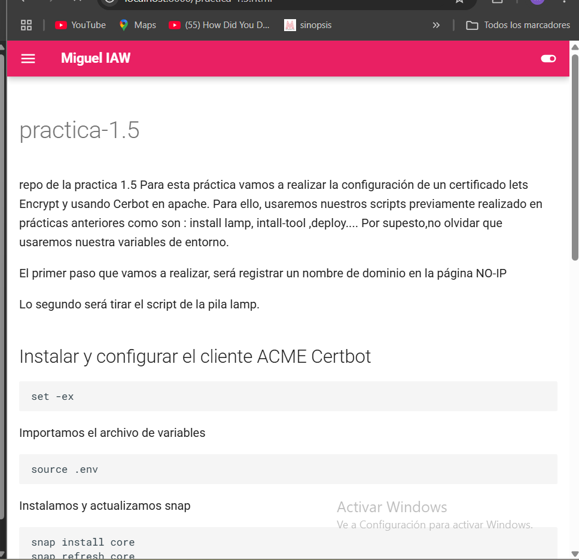
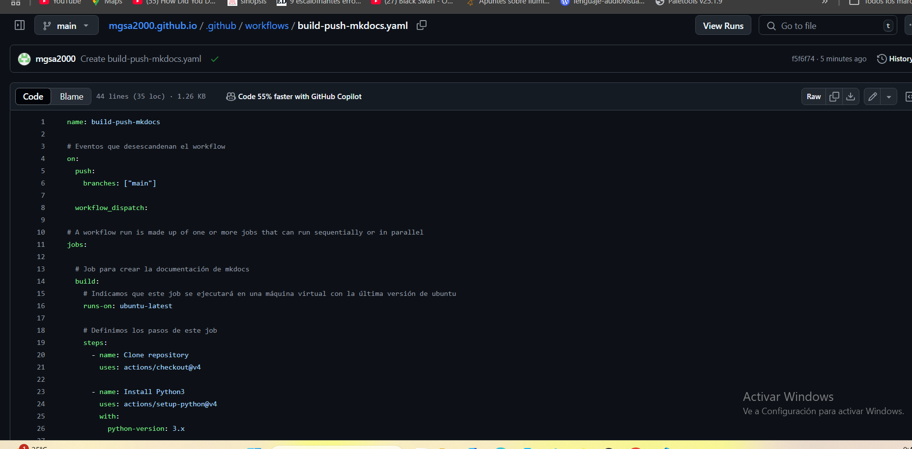

# practica-6.1

 En esta práctica llevaremos a cabo la creación y configuración de un sitios web estático MkDocs y lo publicaremos en GitHub Pages

 ## pasos panteriores

 tener una máquina en aws con docker instalado.

 ## 1. Instalación
 Una vez dentro de nuestra máquina ejecutamos el siguiente comando para ejecutar un nuevo proyecto docker run --rm -it -p 8000:8000 -u $(id -u):$(id -g) -v "$PWD":/docs squidfunk/mkdocs-material new .

 


 El comando anterior creará el archivo de configuración mkdocs.yml y el archivo Markdown index.md dentro del directorio docs.

.
└── proyecto
    ├── docs
    │   └── index.md
    └── mkdocs.yml

## 2. configuración de mkdocs.yml
Una vez hayamos creado el archivo mkdocs,lo editaremos para configurar nuestro sitio web,


````
site_name: Miguel IAW
nav:
    - Principal: index.md
    - Practica 1.5: practica-1.5.md

theme:
  name: material  

  palette:
    # Modo claro
    - scheme: default
      primary: pink
      accent: yellow
      toggle:
        icon: material/toggle-switch
        name: Switch to dark mode

    # Modo oscuro
    - scheme: slate
      primary: cyan
      accent: red
      toggle:
        icon: material/toggle-switch-off-outline
        name: Switch to light mode

  features:
    - header.autohide
    - navigation.footer

extra:
  language: eu
  social:
    - icon: fontawesome/brands/github 
      link: https://github.com/mgsa2000
    - icon: fontawesome/brands/docker
      link: https://hub.docker.com/u/stratachan3


plugins:
  - offline

copyright: Copyright - 2025 Miguel strachan

````

aqui configuramos lo siguiente;

1-Nombre del sitioweb y menú de navegación.
2-Definimos que el color principal del tema sea teal(verde azulado), color de acento negro y además creamos la opción de que mediante un botón podamos poner la página en modo claro o oscuro.

3-Establecemos la opcion de que la barra superior se oculte al scrolear hacia abajo y que se muestren botones de navegación en el pié de página.
4- Ponemos el sitio en español y ponemos dos iconos que nos lleve a nuestra página de github y a docker hub.

5-añadimos el plugging con que el que podremos navegar por la documentacion sin conexión y un mensaje de Copyright en el pie de página.


Para previsualizar como quedaría el sitio web, podemos ejecutar el siguiente comando

docker run --rm -it -p 8000:8000 -u $(id -u):$(id -g) -v "$PWD":/docs squidfunk/mkdocs-material

Y para visualizarlos abriremos un navegador e introduciremos la siguiente dirección http://localhost:8000




## generar la documentación
Para generar los archivos HTML estaticos ejecutamos  
docker run --rm -it -u $(id -u):$(id -g) -v "$PWD":/docs squidfunk/mkdocs-material buil


##  Publicar la documentación en GitHub Pages

Publicamos en github a través del siguiente comando docker run --rm -it -v ~/.ssh:/root/.ssh -v "$PWD":/docs squidfunk/mkdocs-material gh-deploy

el siguiente paso sera crear un workflow con  el siguiente contenido:
````
name: build-push-mkdocs

# Eventos que desescandenan el workflow
on:
  push:
    branches: ["main"]

  workflow_dispatch:

# A workflow run is made up of one or more jobs that can run sequentially or in parallel
jobs:

  # Job para crear la documentación de mkdocs
  build:
    # Indicamos que este job se ejecutará en una máquina virtual con la última versión de ubuntu
    runs-on: ubuntu-latest
    
    # Definimos los pasos de este job
    steps:
      - name: Clone repository
        uses: actions/checkout@v4

      - name: Install Python3
        uses: actions/setup-python@v4
        with:
          python-version: 3.x

      - name: Install Mkdocs
        run: |
          pip install mkdocs
          pip install mkdocs-material 

      - name: Build MkDocs
        run: |
          mkdocs build

      - name: Push the documentation in a branch
        uses: s0/git-publish-subdir-action@develop
        env:
          REPO: self
          BRANCH: gh-pages # The branch name where you want to push the assets
          FOLDER: site # The directory where your assets are generated
          GITHUB_TOKEN: ${{ secrets.GITHUB_TOKEN }} # GitHub will automatically add this - you don't need to bother getting a token
          MESSAGE: "Build: ({sha}) {msg}" # The commit message

````




Por último tendremos que configurar los permisos del workflow y marcar Read and write permissions.


